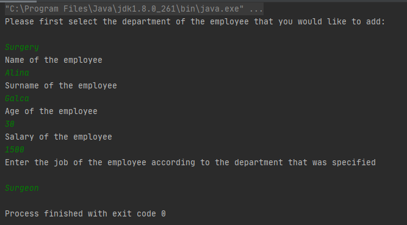

# Lab.1 Topic: *Creational Design Patterns*

------
## Table of Contents

* [Objectives](#objectives)
* [Some Theory](#theory)
* [Main Tasks](#main-tasks)
* [Implementation](#implementation)
* [Results](#results)
* [Conclusions](#conclusions)
* [Author](#author)
------
## Objectives:

__1. Study and understand the Creational Design Patterns.__

__2. Choose a domain, define its main classes/models/entities and choose the appropriate instantiation mechanisms.__

__3. Use some creational design patterns for object instantiation in a sample project.__

## Some Theory :

In software engineering, the creational design patterns are the general solutions that deal with object creation, trying to create objects in a manner suitable to the situation. The basic form of object creation could result in design problems or added complexity to the design. Creational design patterns solve this problem by optimizing, hiding or controlling the object creation.

Some examples of this kind of design patterns are :

   * Singleton
   * Builder
   * Prototype
   * Object Pooling
   * Factory Method
   * Abstract Factory
   
## Main tasks :

__1. Choose an OO programming language and a suitable IDE or Editor;__

__2. Select a domain area for the sample project;__

__3. Define the main involved classes and think about what instantiation mechanisms are needed;__

__4. Based on the previous point, implement atleast 3 creational design patterns in your project;__

## Implementation

__In this lab it was implemented a project based on medical center (hospital) human resources data instatiation;__

__This project illustrates the implementation of the following creational design patterns:__
   * Singleton
   * Builder
   * Factory Method
   * Abstract Factory
 
In this lab we have an hospital which has employees that are working in 3 different departments and have a set of attributes like: name, surname, age, salary and job type.
But the idea of mapping a job to a certain employee while instatiating an object of this type depends on some builder methods which are taken by specific factory methods that corresponds to a specific department. In other words, the idea is that
it should be impossible to create a Pediater, for example, in the Surgery department.

__1.Singleton__

Singleton is a design pattern that restricts the instantiation of a class to one "single" instance. 

~~~
 public static synchronized Factory getInstance(){
        if(instance == null) {
            instance = new Factory();
        }
        return instance;
    }
 ~~~

__2.Builder__

Builder is a design pattern that allows to produce different objects using the same code and constructs complex objects step by step.
In this case, the creation of an __employee__ is seen as a complex object creation.

First, in the process of creation of an object, it is instatiated the factory depending on the department that is specified:

~~~
    public AbstractFactory getFactory(String department){
        AbstractFactory fc = null;
        switch(department){
            case "Surgery":
                fc = new SurgeryFactory();
                break;
            case "Cardiology":
                fc = new CardiologyFactory();
                break;
            case "Pediatry":
                fc= new PediatryFactory();
                break;
            default:
                System.out.println("Unexisting department in our hospital");
                break;
        }
        return fc;

    }
~~~
Then we chose the builder method depending on the factory:
~~~
class SurgeryFactory extends AbstractFactory{
    public EmployeesBuilder getEmployeesJobType(String job){
        EmployeesBuilder jobtype = null;
        switch(job){
            case "Surgeon":
                jobtype = new SurgeonBuild();
                break;
            case "Surgeon Assistant":
                jobtype =  new SurgeonAssistantBuild();
                break;
            case "Surgery Nurse":
                jobtype = new NurseSurgeryBuild();
                break;
            default:
                System.out.println("No such job in surgery department!");
        }
        return jobtype;
    }
}
 ~~~

And then we get to the corresponding builder method, that can create different corresponding objects:

~~~
//builder
    public EmployeesBuilder(){
        employee=new MedicalCenterEmployee();

    }

    public void addName(String name) {
        employee.setName(name);
    }

    public void addSurname(String surname) {
        employee.setSurname(surname);
    }

    public void addAge(Integer age) {
        employee.setAge(age);
    }

    public void addSalary(Integer salary) {
        employee.setSalary(salary);
    }

    public void addDepartment(String department) {
        employee.setDepartment(department);
    }

    public void addJob(String job) {
        employee.setJob(job);
    }
    public abstract String getJobType();

}
...
~~~

In other words, we provide a flexible solution of various __MedicalCenterEmployee__ object creation with same creational functions.

__3.Factory__

The idea of factory pattern is that subclasses are responsible to create instance of the class.
In this example, the factory methods are obtained by defining an abstract class __AbstractFactory__ , but the subclases (SurgeryFactory,CardiologyFactory,PediatricFactory) decide which class to instantiate, based on the department jobtype:

~~~

class SurgeryFactory extends AbstractFactory{
    public EmployeesBuilder getEmployeesJobType(String job){
        EmployeesBuilder jobtype = null;
        switch(job){
            case "Surgeon":
                jobtype = new SurgeonBuild();
                break;
            case "Surgeon Assistant":
                jobtype =  new SurgeonAssistantBuild();
                break;
            case "Surgery Nurse":
                jobtype = new NurseSurgeryBuild();
                break;
            default:
                System.out.println("No such job in surgery department!");
        }
        return jobtype;
    }
}
~~~

__4.Abstract factory__

Abstract factory is used to kind of isolate the client code from concrete classes implementation and it is realised via an implementation 
of an abstract class for creating related or dependent objects without specifying their concrete sub-classes. 
In other words, we have an additional level of abstractisation, the AbstractFactory class defines Factory Methods for each type of new object that is created :

~~~
public abstract class AbstractFactory {

    public abstract EmployeesBuilder getEmployeesJobType(String job);

}

    public AbstractFactory getFactory(String department){
        AbstractFactory fc = null;
        switch(department){
            case "Surgery":
                fc = new SurgeryFactory();
                break;
            case "Cardiology":
                fc = new CardiologyFactory();
                break;
            case "Pediatry":
                fc= new PediatryFactory();
                break;
            default:
                System.out.println("Unexisting department in our hospital");
                break;
        }
        return fc;

    }
~~~

## Results

## Conclusions

The main goal of this laboratory work was to put into practive Creational Design Patterns.
Generally speaking, design patterns are a very important field of computer science that is important in order to become a developper,
as design patterns are reusable in multiple projects and provide solutions that can help
define and build a good system architecture.

## Author: 

__Malîi Antonela FAF-192__